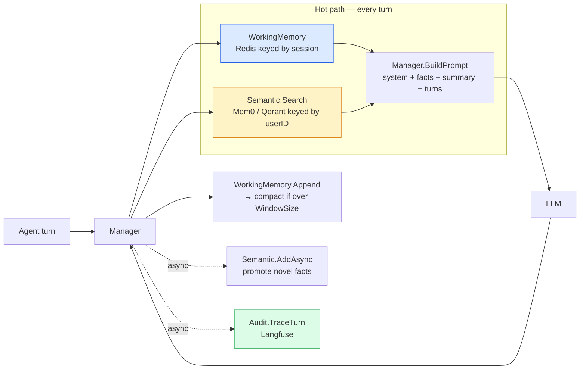
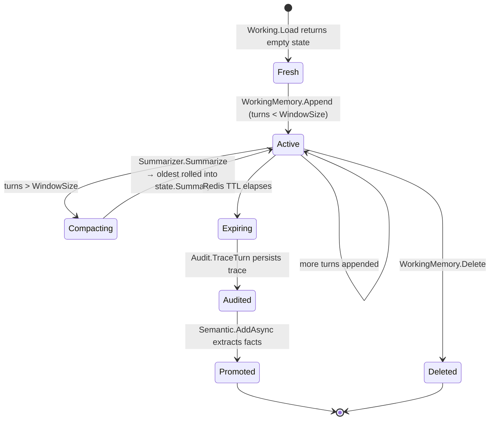
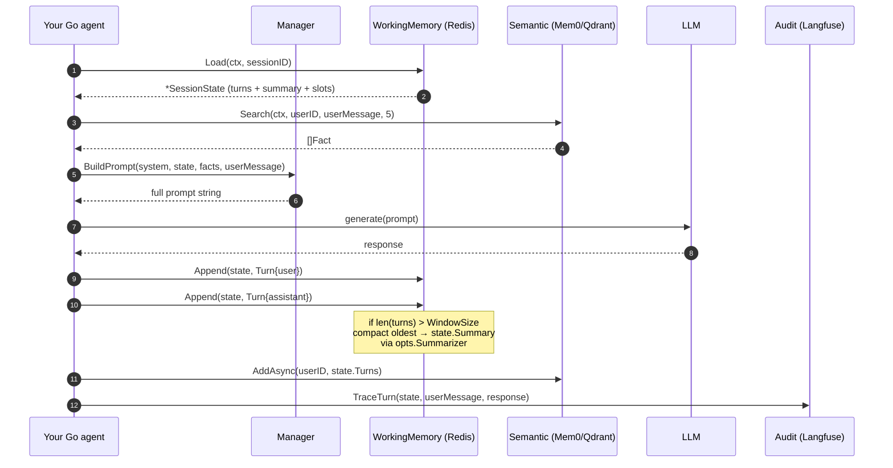

# agent-memory-go

[](https://pkg.go.dev/github.com/numoru-ia/agent-memory-go)
[](LICENSE)
[](https://go.dev)

> **Go library implementing the tiered memory pattern for production LLM agents.** Redis for the rolling working-memory window, Mem0/Qdrant for consolidated semantic facts, and Langfuse for auditable trace history — behind a single `Manager` type with a `BuildPrompt` helper that stitches them together.

Companion article: [Langfuse + Redis + Mem0 como memoria de agentes en producción](https://numoru.com/en/contributions/langfuse-redis-memoria-agentes).

---

## Why tiered memory

A naive LLM agent keeps "the whole conversation" in its context window. That pattern works for demos, but in production it collapses in three directions: latency (long prompts), cost (every turn re-bills history), and fidelity (important facts get pushed out as history grows).

The tiered pattern splits memory by **access frequency × permanence**:

| Tier | Where | Latency | TTL | Access pattern | Size bound |
|---|---|---|---|---|---|
| **Working** | Redis | ~3 ms | configurable (default 1h) | Rolling window of last N turns + slot-fill + summary | `WindowSize` turns (default 6) + summary string |
| **Semantic** | Mem0 / Qdrant (via `Semantic` interface) | ~30 ms | indefinite | Similarity search over consolidated facts per `userID` | Unbounded, scored |
| **Audit** | Langfuse (via `Audit` interface) | async | 90+ days | Reproducibility, not live retrieval | Unbounded, append-only |

The hot path reads **Working + top-k Semantic**; the cold path (shutdown, idle) flushes to Audit and promotes novel facts to Semantic.

---

## Install

```bash
go get github.com/numoru-ia/agent-memory-go
```

Requires **Go 1.22+**. Depends on `github.com/redis/go-redis/v9` for the working-memory store. `Semantic` and `Audit` are interfaces — bring your own Mem0/Qdrant and Langfuse adapters (see sister library [`langfuse-go`](https://github.com/numoru-ia/langfuse-go) for a Langfuse client that satisfies the `Audit` contract with a thin wrapper).

---

## Quick start

```go
package main

import (
    "context"
    "time"

    "github.com/redis/go-redis/v9"
    "github.com/numoru-ia/agent-memory-go/memory"
)

func main() {
    ctx := context.Background()
    rdb := redis.NewClient(&redis.Options{Addr: "localhost:6379"})

    wm := memory.NewWorking(rdb, memory.WorkingOpts{
        TTL:        time.Hour,
        WindowSize: 6,
        Summarizer: myLLMSummarizer{}, // implements memory.Summarizer
        KeyPrefix:  "mem:session:",
    })

    mgr := &memory.Manager{
        Working:  wm,
        Semantic: myMem0Adapter{},   // implements memory.Semantic
        Audit:    myLangfuseAdapter{}, // implements memory.Audit
    }

    state, _ := mgr.Working.Load(ctx, "session-42")
    facts, _ := mgr.Semantic.Search(ctx, state.UserID, userMessage, 5)
    prompt := mgr.BuildPrompt(systemPrompt, state, facts, userMessage)

    response := callLLM(ctx, prompt)

    _ = mgr.Working.Append(ctx, state, memory.Turn{Role: "user", Content: userMessage})
    _ = mgr.Working.Append(ctx, state, memory.Turn{Role: "assistant", Content: response})
    mgr.Semantic.AddAsync(ctx, state.UserID, state.Turns) // promote novel facts
    _ = mgr.Audit.TraceTurn(ctx, state, userMessage, response)
}
```

---

## Architecture



### Memory record — state diagram



### Read-then-write cycle — sequence



---

## API surface

### Types

| Symbol | Purpose |
|---|---|
| `Turn` | `{Role, Content, Tokens, CreatedAt}` — one conversational unit |
| `SessionState` | `{SessionID, UserID, TenantID, Turns, Summary, Slots, TokenBudget}` — the working memory record |
| `Fact` | `{Content, Score, Source}` — one consolidated semantic-memory entry |
| `SummarizeInput` | `{PreviousSummary, NewTurns}` — what gets passed into a `Summarizer` |
| `WorkingOpts` | `{TTL, WindowSize, Summarizer, KeyPrefix}` |
| `CacheOpts` | `{TTL, KeyPrefix}` |

### Interfaces

| Interface | Contract |
|---|---|
| `Summarizer` | `Summarize(ctx, SummarizeInput) (string, error)` — called when the window overflows |
| `Semantic` | `Search(ctx, userID, query, limit) ([]Fact, error)` · `AddAsync(ctx, userID, []Turn)` · `Delete(ctx, userID, factID) error` |
| `Audit` | `TraceTurn(ctx, *SessionState, input, output) error` |

### Constructors and methods

| Symbol | Purpose |
|---|---|
| `NewWorking(rdb, WorkingOpts) *WorkingMemory` | Wire Redis-backed working memory |
| `(*WorkingMemory).Load(ctx, sessionID) (*SessionState, error)` | Read, returning a fresh state on miss |
| `(*WorkingMemory).Append(ctx, *SessionState, Turn) error` | Add a turn; auto-compacts when over `WindowSize` |
| `(*WorkingMemory).Delete(ctx, sessionID) error` | Drop the session |
| `Manager{Working, Semantic, Audit}` | Composition point — call its helper below |
| `(*Manager).BuildPrompt(system, *SessionState, []Fact, userMessage) string` | Assembles prompt: system + facts + summary + turns + user message |
| `NewSemanticCache(rdb, CacheOpts) *SemanticCache` | Exact-match cache keyed by sha256 of the prompt |
| `(*SemanticCache).GetOrCompute(ctx, prompt, fn) (string, error)` | Cache-aside wrapper around an LLM call |
| `(*SemanticCache).Invalidate(ctx, prompt) error` | Manual invalidation |

---

## Configuration

| `WorkingOpts` field | Default | Purpose |
|---|---|---|
| `TTL` | `1 * time.Hour` | Redis key expiry for the session record |
| `WindowSize` | `6` | Max unrolled turns before compaction kicks in |
| `Summarizer` | `nil` | Required to compact; without it, turns grow unbounded |
| `KeyPrefix` | `mem:session:` | Redis key prefix for isolation across services |

| `CacheOpts` field | Default | Purpose |
|---|---|---|
| `TTL` | `24 * time.Hour` | Answer TTL |
| `KeyPrefix` | `mem:cache:` | Redis key prefix |

### External endpoints (passed into your adapters)

| Env var | For |
|---|---|
| `REDIS_URL` | Working memory + cache |
| `MEM0_URL` / `MEM0_API_KEY` | Your `Semantic` adapter |
| `QDRANT_URL` / `QDRANT_API_KEY` | Alternative `Semantic` backend |
| `LANGFUSE_HOST` / `LANGFUSE_PUBLIC_KEY` / `LANGFUSE_SECRET_KEY` | Your `Audit` adapter |

---

## Heuristics (suggested policy)

| Signal | Action |
|---|---|
| Regular turn | Working only |
| User says "always / prefer / I am X" | Extract → `Semantic.AddAsync` |
| Structured field (email, RFC, date) | Store as a `SessionState.Slots` entry |
| `WindowSize + 1` reached | Auto-compact oldest into `state.Summary` |
| Session idle > TTL | Flush to `Audit`; promote novel facts to `Semantic` |
| User says "forget me" | `Semantic.Delete` for every fact under the user |

---

## Semantic cache (optional)

```go
cache := memory.NewSemanticCache(rdb, memory.CacheOpts{TTL: 24 * time.Hour})

response, err := cache.GetOrCompute(ctx, prompt, func() (string, error) {
    return callLLM(ctx, prompt)
})
```

`SemanticCache` is an **exact-match** cache keyed by `sha256(prompt)` — deterministic, simple, no embedding roundtrip. For similarity-based caching, wrap a RedisVL backend behind the same `GetOrCompute` shape.

---

## Testing patterns

- **Unit-test with `miniredis`** (`github.com/alicebob/miniredis/v2`) — no live Redis needed. Assert key naming, TTL application, and compaction triggers.
- **Contract-test the `Summarizer`** against a fixture of 8+ turns to confirm compaction actually shortens content.
- **Mock `Semantic` and `Audit`** in unit tests; use `testcontainers-go` for real Mem0/Qdrant + Langfuse runs in integration CI.

## Best practices

- **Always set a `Summarizer`.** Without it, the window grows unbounded and Redis writes get progressively slower.
- **Pick `WindowSize` = LLM context budget / average turn tokens**, minus a safety margin for the summary + facts.
- **Don't put PII in the summary.** Summarizers should be prompted to exclude emails, phones, RFCs — keep those in `Slots`.
- **Audit asynchronously.** `TraceTurn` should not block user-visible latency.
- **Invalidate the cache on side-effecting tool calls.** `GetOrCompute` assumes the prompt is deterministic wrt tools.

## Roadmap

- [ ] Ship a first-party Langfuse `Audit` adapter built on `langfuse-go`
- [ ] Ship a first-party Mem0 `Semantic` adapter
- [ ] RedisVL-backed `SimilarityCache` companion to `SemanticCache`
- [ ] Native OpenTelemetry spans around every public method
- [ ] `Slots` schema validation (pluggable validators)

## License

Apache 2.0 — see [LICENSE](LICENSE).
